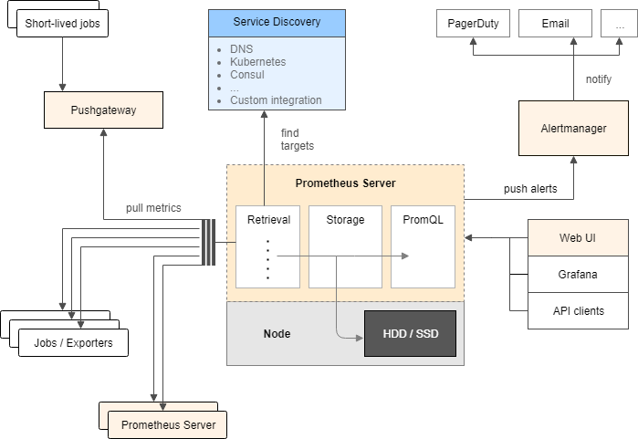
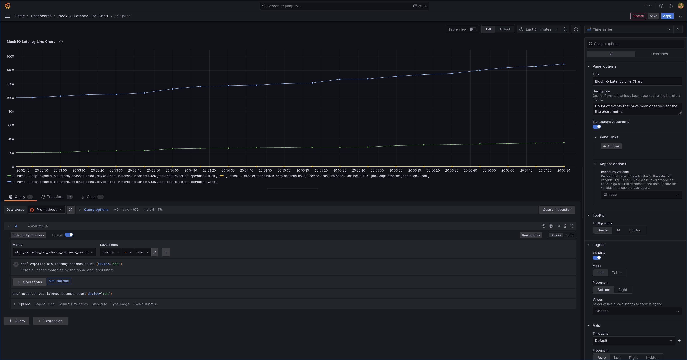

# Features

1. Methodology: combined toolchain
2. Kernel tracing: eBPF
3. Linux based platform: Ubuntu, Debian
4. Data exporter: ebpf_exporter
5. Database: Prometheus
6. Visualization: Grafana

# Requirements

explain the used tools.

Here are the details of dependencies below.

## bcc

**Toolkit and library for efficient BPF-based kernel tracing.**

`BCC` is a toolkit for creating efficient kernel tracing and manipulation programs built upon eBPF, and includes several useful command-line tools and examples. BCC eases writing of eBPF programs for kernel instrumentation in C, includes a wrapper around LLVM, and front-ends in Python and Lua. It also provides a high-level library for direct integration into applications.

The Monitor tool depends on `libbpf` to load eBPF code into the kernel, and you need to have it installed on your system. Note that there's a dependency between `libbpf` version you have installed and `libbpfgo`, which is Go's library to talk to libbpf. Currently we target a stable version, libbpf v1.2.

- Github repo: https://github.com/iovisor/bcc
- Installation: https://github.com/iovisor/bcc/blob/master/INSTALL.md#ubuntu---binary

Installing instructions(Ubuntu-based, by `apt`):

```bash
sudo apt update
sudo apt install bpfcc-tools linux-headers-$(uname -r) -y
```

## libbpf

- Github repo: https://github.com/libbpf/libbpf

The following commands are used to install `libbpf` by `apt` on Debian or Ubuntu.

```bash
sudo apt update
sudo apt install -y gcc build-essential git make libelf-dev strace tar bpfcc-tools libbpf-dev linux-headers-$(uname -r)
sudo apt install -y clang llvm
```

## ebpf_exporter

- Github repo: https://github.com/cloudflare/ebpf_exporter

`ebpf_exporter` depends on `libbpf` to load eBPF code into the kernel, and you need to have it installed on your system. Alternatively, you can use the bundled `Dockerfile` to have libbpf compiled in there.

**Note1:** there's a dependency between `libbpf` version you have installed and `libbpfgo`, which is Go's library to talk to libbpf. Currently we target `libbpf v1.2`, which has a stable interface.

**Note2:** when using `apt` to install libbpf on your OS like Debian and Ubuntu, there might exist a mismatch between libbpf version and libbpfgo version. You can check the version info by using command `dpkg -l | grep libbpf`, because the software repository of `apt` on Debian and Ubuntu (2018LTS, 2020LTS, 2022LTS and so on) is not that new enough. In this case, it is advised to build and install `libbpf` from source code.

We compile ebpf_exporter with libbpf `statically` compiled in, so there's only ever a chance of build time issues, never at run time.

There are two ways to build the binary file of ebpf_exporter (if you encounter really hard problems of building on the host, building in Docker is a good alternative):

```bash
# Build on host.
make clean build
make -C examples clean build

# Build on Docker.
docker build -t ebpf_exporter .
docker cp $(docker create ebpf_exporter):/ebpf_exporter ./
make -C examples clean build
```

## Prometheus

Prometheus is a free software application used for event monitoring and alerting. It records metrics in a time series database built using an HTTP pull model, with flexible queries and real-time alerting. The basic structure of Prometheus is shown as below.



- Installation: https://prometheus.io/download/, Prometheus v2.37.8
- Document: https://prometheus.io/docs/introduction/overview/

Installing instructions(Ubuntu-based):

```bash
curl -OL https://github.com/prometheus/prometheus/releases/download/v2.37.8/prometheus-2.37.8.linux-amd64.tar.gz
tar -zxvf prometheus-2.37.8.linux-amd64.tar.gz
```

## Grafana

- Installation: https://grafana.com/docs/grafana/latest/setup-grafana/installation/debian/
- Document: https://grafana.com/docs/grafana/latest/

Grafana Enterprise vs OSS: Grafana Enterprise is the recommended and default edition. It is available for free and includes all the features of the OSS edition. You can also upgrade to the full Enterprise feature set, which has support for Enterprise plugins.

Installing instructions(Ubuntu-based, by `apt`):

```bash
# To install required packages and download the Grafana repository signing key, run the following commands:
sudo apt install -y apt-transport-https
sudo apt install -y software-properties-common wget
sudo wget -q -O /usr/share/keyrings/grafana.key https://apt.grafana.com/gpg.key

# To add a repository for stable releases, run the following command:
echo "deb [signed-by=/usr/share/keyrings/grafana.key] https://apt.grafana.com stable main" | sudo tee -a /etc/apt/sources.list.d/grafana.list

# To add a repository for beta releases, run the following command:
echo "deb [signed-by=/usr/share/keyrings/grafana.key] https://apt.grafana.com beta main" | sudo tee -a /etc/apt/sources.list.d/grafana.list

# After you add the repository, run the following commands to install the OSS or Enterprise release:
# Update the list of available packages
sudo apt update
# Install the latest OSS release:
sudo apt install -y grafana
# Install the latest Enterprise release:
sudo apt install -y grafana-enterprise
```

# Installation

explain how to install this tool.

```bash
git clone https://github.com/zhsh9/LinMonitor.git
cd LinMonitor
# use Makefile to install dependencies.
make prepare

# or use script to install dependencies.
chmod +x ./install_dependencies.sh
./install_dependencies.sh
```

You should change details inside `install_dependencies.sh` if dipendencies directory is empty.

# Usage

explain how to use this tool.

```bash
make build  # build binary files of dependencies.
make server # start servers.
make clean  # kill processes of servers.
```

Enter `http://localhost:3000` in a browser to configure Grafana panels.

# Grafana Snapshot



Complementation of indices from Linux kernel:

- bio_latency_seconds: TCP SYN backlog size
- tcp_syn_backlog: TCP SYN backlog size
- tcp_window_clamps_total: Number of times that TCP window was clamped to a low value

# Furthermore

Extract more indices from Linux kernel:  
(thourgh more file inside `./dependencies/ebpf_exporter/examples/xxx.bpf.c and xxx.yaml`)

- time consumption of tcp connection
- rtt(tound-trip time) of tcp
- times of network retransmission

# eBPF Kernel Side

- tcp rtt(round-trip time):
  - `tcp-rtt.bpf.c` and `tcp-rtt.yaml`
- time consumption of tcp connection:
  - `tcp-connection-consumption.bpf.c` and `tcp-connection-consumption.bpf.yaml`
- time of network retransmission:
  - `network-retransmission-time.bpf.c` and `network-retransmission-time.bpf.yaml`

# Kernel Code Explanation

## Block IO Latency

- 使用eBPF技术实现了块IO（Block IO）延迟的计数。当块IO请求被插入时，eBPF程序会在`block_rq_insert`和`block_rq_issue`内核函数入口处被调用，获取所传递的request结构体，并存储当前时间戳。当块IO请求完成时，程序会在`block_rq_complete`内核函数入口处被调用，获取所传递的request结构体，并计算出块IO请求的延迟。然后，它将延迟除以2的幂，计算出延迟的bucket，分别将bucket计数加入名为`bio_latency_seconds`的哈希表中。此外，代码中还包括了一个metrics的YAML配置，定义了一个名为bio_latency_seconds的指数直方图(Histogram)。
- `bits.bpf.h`中包含了一些通用宏定义和函数声明，如log2和log2l等。
- `maps.bpf.h`中包含了一个用于原子性地将一个哈希表中给定key的值增加increment的函数increment_map。
- `biolatency.bpf.c`中定义了三个eBPF程序，分别对应于块IO请求插入、块IO请求发出和块IO请求完成三个事件。这些程序在处理事件时，会将块IO请求的延迟信息存储到名为bio_latency_seconds的哈希表中。
- `biolatency.yaml`中定义了一个名为bio_latency_seconds的指数直方图(Histogram)，用于对块IO请求的延迟信息进行统计。其中，延迟信息被分为了27个bucket，每个bucket的大小是前一个bucket大小的两倍。每个bucket的值表示对应延迟范围内的块IO请求数量。另外，每个bucket还会记录设备号、操作类型和延迟大小等相关信息。

## TCP SYN Backlog

- 使用eBPF技术实现了获取TCP SYN backlog的大小。
- eBPF程序会在`tcp_v4_syn_recv_sock`和`tcp_v6_syn_recv_sock`内核函数入口处被调用，获取所传递的sock结构体，并读取其sk_ack_backlog成员的值。然后，它将sk_ack_backlog除以50，计算出backlog的bucket，分别将bucket计数和backlog计数加入名为tcp_syn_backlog的哈希表中。
- 代码中包括了一个metrics的YAML配置，定义了一个名为tcp_syn_backlog的线性直方图(Histogram)。

## TCP Window Clamps

- 使用eBPF技术实现了获取TCP窗口被钳制为低值的次数。
- 它会在内核函数`tcp_try_rmem_schedule`的入口处和出口处被调用。在入口处，它会将当前socket结构体指针插入一个名为tcp_rmem_schedule_enters的哈希表中。在出口处，它会从哈希表中查找socket结构体指针，然后调用handle_tcp_sock函数处理该socket的窗口大小。如果窗口大小小于一个预定义的最小值`MIN_CLAMP`，它将会递增名为tcp_window_clamps_total的计数器。
- 代码中包括一个metrics的YAML配置，用于定义一个名为tcp_window_clamps_total的计数器。
